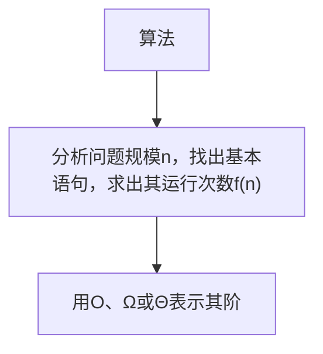

# 目录
- [目录](#目录)
- [时间复杂度](#时间复杂度)

# 时间复杂度

> 设n为算法中的问题规模，通常用大O、大Ω和Θ等三种渐进符号表示算法的执行时间与n之间的一种增长关系。


> 算法的平均情况是指用各种特定输入下的基本语句执行次数的带权平均值。

算法的最好情况为：G(n)=${\mathop{MIN} \limits_{I \in D_n}} \{T(I)\}$，是指算法在所有输入I下所执行基本语句的最少次数。
算法的最坏情况为：W(n)=${\mathop{MAX} \limits_{I \in D_n}} \{T(I)\}$，是指算法在所有输入I下所执行基本语句的最大次数。

```c++
#include <iostream>
using namespace std;
void Hanoi(int n, char x, char y, char z)
{
    if (n == 1)
    {
        printf("将盘片%d从%c搬到%c\n", n, x, z);
    }
    else
    {
        Hanoi(n - 1, x, z, y);
        printf("将盘片%d从%c搬到%c\n", n, x, z);
        Hanoi(n - 1, y, x, z);
    }
}
int main()
{
    Hanoi(3, 'x', 'y', 'z');
    return 0;
}
```

