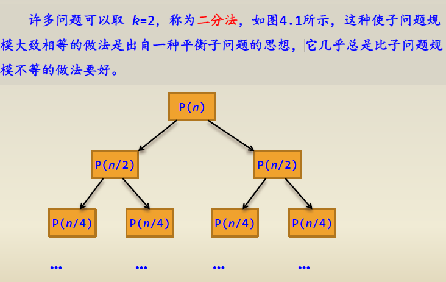
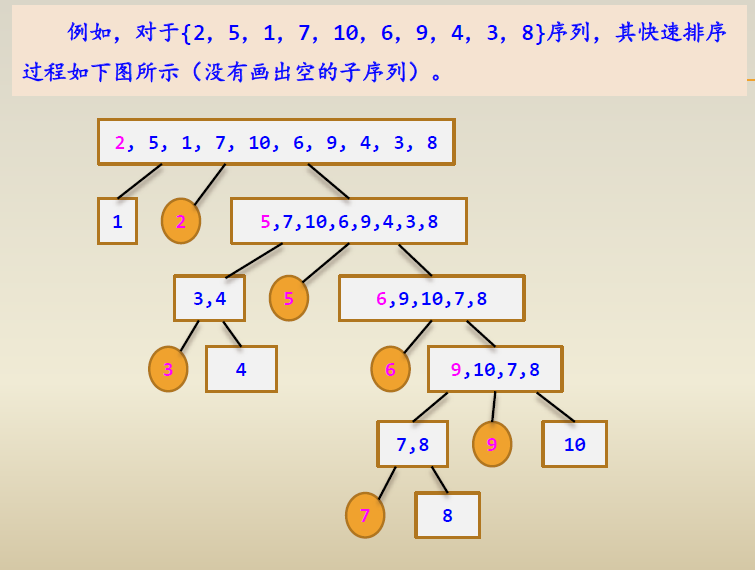
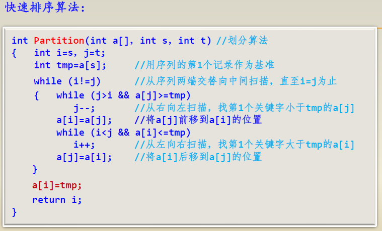
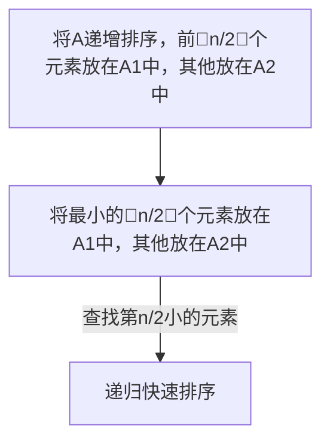
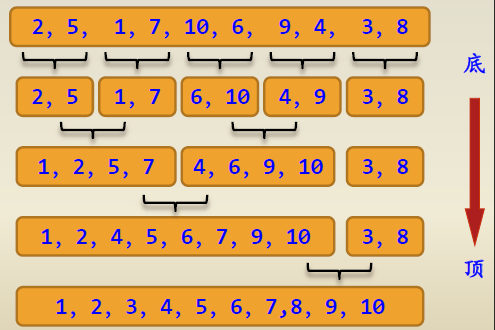
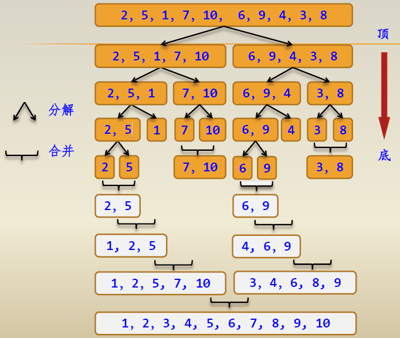

> 思想：将一个问题分解成若干个小问题逐一解决
# 目录
- [目录](#目录)
  - [二分法](#二分法)
    - [1.快速排序](#1快速排序)
      - [快速排序时间复杂度：](#快速排序时间复杂度)
      - [**2016年全国计算机学科专业考研题:**](#2016年全国计算机学科专业考研题)
    - [2.归并排序](#2归并排序)


## 二分法



### 1.快速排序

[./demo01-quick_sort.cpp](./demo01-quick_sort.cpp) 
    
>基本思想：在待排序的n个元素中任取一个元素（通常取第一个元素）作为基准，把该元素放入最终位置后，整个数据序列被基准分割成两个子序列，所有小于基准的元素放置在前子序列中，所有大于基准的元素放置在后子序列中，并把基准排在这两个子序列的中间，这个过程称作划分。
>然后对两个子序列分别重复上述过程，直至每个子序列内只有一个记录或空为止。


ex:



ex code:



#### 快速排序时间复杂度：
    
1. 快速排序的时间主要耗费在划分操作上，对长度为n的区间进行划分，共需n-1次关键字的比较，时间复杂度为O(n)
2. 对n个记录进行快速排序的过程构成一棵递归树，在这样的递归树中，每一层至多对n个记录进行划分，所花时间为O(n)。
3. 当初始排序数据正序或反序时，此时的递归树高度为n，快速排序呈现最坏情况，即最坏情况下的时间复杂度为O(n^2)；
4. 当初始排序数据随机分布，使每次分成的两个子区间中的记录个数大致相等，此时的递归树高度为log2n，快速排序呈现最好情况，即最好情况下的时间复杂度为O(nlog2n)。快速排序算法的平均时间复杂度也是O(nlog2n)。

-----------------------
#### **2016年全国计算机学科专业考研题:**

> 已知由n（n≥2）个正整数构成的集合A={ak}（0≤k<n），将其划分为两个不相交的子集A1和A2，元素个数分别是n1和n2，A1和A2中元素之和分别为S1和S2。设计一个尽可能高效的划分算法，满足|n1-n2|最小且|S1-S2|最大。要求：
>
>（1）给出算法的基本设计思想。
>
>（2）根据设计思想，采用C、C++描述算法，关键之处给出注释。
>
>（3）说明你所设计算法的时间复杂度和空间复杂度。

**思路：**


example code:
```c++
int Partition(int a[], int low, int high) //以a[low]为基准划分
{
    int i = low, j = high;
    int povit = a[low];
    while (i < j)
    {
        while (i < j && a[j] >= povit)
            j--;
        a[i] = a[j];
        while (i < j && a[i] <= povit)
            i++;
        a[j] = a[i];
    }
    a[i] = povit;
    return i;
}

int Solution(int a[], int n) //求解
{
    int low = 0, high = n - 1;
    bool flag = true;
    while (flag)
    {
        int i = Partition(a, low, high);
        if (i == n / 2 - 1) //基准a[i]为第n/2的元素
            flag = false;
        else if (n / 2 - 1 > i) //在右区间查找
            low = i + 1;
        else
            high = i - 1; //在左区间查找
    }
    int s1 = 0, s2 = 0;
    for (int i = 0; i < n / 2; i++)
        s1 += a[i];
    for (int j = n / 2; j < n; j++)
        s2 += a[j];
    return s2 - s1;
}
```
### 2.归并排序

> 归并排序的基本思想是：首先将a[0..n-1]看成是n个长度为1的有序表，将相邻的k（k≥2）个有序子表成对归并，得到n/k个长度为k的有序子表；然后再将这些有序子表继续归并，得到n/k2个长度为k2的有序子表，如此反复进行下去，最后得到一个长度为n的有序表。
> 
>若k=2，即归并在相邻的两个有序子表中进行的，称为二路归并排序。若k>2，即归并操作在相邻的多个有序子表中进行，则叫多路归并排序。

1. 自底向上的二路归并排序算法



2. 自顶向下的二路归并排序的过程




