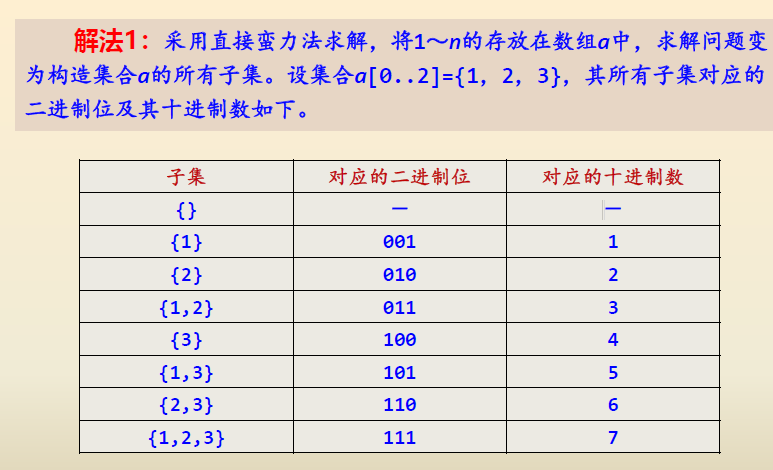

目录
- [蛮力法求解幂集](#蛮力法求解幂集)
- [背包问题](#背包问题)

## 蛮力法求解幂集

[解法一](./demo01-subset.cpp)

## 背包问题
> 【问题描述】有n个重量分别为{w1，w2，…，wn}的物品，它们的价值分别为{v1，v2，…，vn}，给定一个容量为W的背包。设计从这些物品中选取一部分物品放入该背包的方案，每个物品要么选中要么不选中，要求选中的物品不仅能够放到背包中，而且具有最大的价值。
并对下表所示的4个物品求出W=6时的所有解和最佳解。

> 【问题求解】对于n个物品、容量为W的背包问题，采用前面求幂集的方法求出所有的物品组合。
对于每一种组合，计算其总重量sumw和总价值sumv，当sumw小于等于W时，该组合是一种解，并通过比较将最佳方案保存在maxsumw和maxsumv中，最后输出所有的解和最佳解。

| 物品编号 | 重量 | 价值 |
|:--------:|:----:|:----:|
|    1     |  5   |  4   |
|    2     |  3   |  4   |
|    3     |  2   |  3   |
|    4     |  1   |  1   |

[背包问题cpp](demo01-backpack_problem.cpp)

