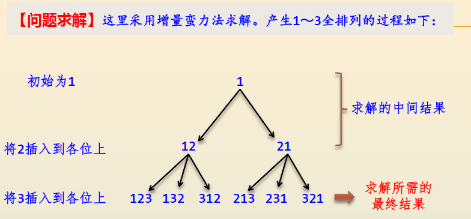
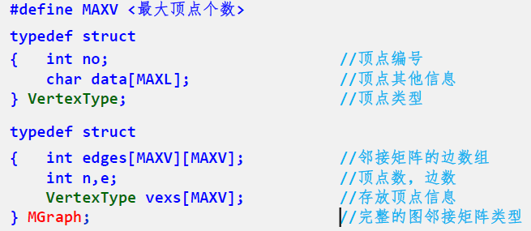

目录
- [蛮力法求解幂集](#蛮力法求解幂集)
- [背包问题](#背包问题)
- [全排列问题](#全排列问题)
  - [任务分配问题](#任务分配问题)

## 蛮力法求解幂集

[解法一](./demo01-subset.cpp)

## 背包问题
> 【问题描述】有n个重量分别为{w1，w2，…，wn}的物品，它们的价值分别为{v1，v2，…，vn} ，给定一个容量为W的背包。设计从这些物品中选取一部分物品放入该背包的方案，每个物品要么选中要么不选中，要求选中的物品不仅能够放到背包中，而且具有最大的价值。
> 
> 并对下表所示的4个物品求出W=6时的所有解和最佳解。

> 【问题求解】对于n个物品、容量为W的背包问题，采用前面求幂集的方法求出所有的物品组合。
> 
> 对于每一种组合，计算其总重量sumw和总价值sumv，当sumw小于等于W时，该组合是一种解，并通过比较将最佳方案保存在maxsumw和maxsumv中，最后输出所有的解和最佳解。

| 物品编号 | 重量 | 价值 |
|:--------:|:----:|:----:|
|    1     |  5   |  4   |
|    2     |  3   |  4   |
|    3     |  2   |  3   |
|    4     |  1   |  1   |

[0/1背包问题用蛮力法求解cpp](backpack-problem/main.cpp)

用蛮力法求出所有可能的集合，然后计算每种集合的weight和value找到最优解

## 全排列问题
>【问题描述】对于给定的正整数$n(n≥1)$，求1～n的所有全排列。

> 【算法分析】对于给定的正整数n，每一种全排列都必须处理，有$n!$种，所以上述算法的时间复杂度为$O(n*n!)$。

### 任务分配问题
> 【问题描述】有n（n≥1）个任务需要分配给n个人执行，每个任务只能分配给一个人，每个人只能执行一个任务。
> 
> 第i个人执行第j个任务的成本是c[i][j]（1≤i，j≤n）。求出总成本最小的分配方案。

>【问题求解】所谓一种分配方案就是由第i个人执行第j个任务，用（a1，a2，…，an）表示，即第1个人执行第a1个任务，第2个人执行第a2个任务，以此类推。全部的分配方案恰好是1～n的全排列。
>
>这里采用增量穷举法求出所有的分配方案ps（全排列），再计算出每种方案的成本，比较求出最小成本的方案，即最优方案。以n=4，成本如下表所示为例讨论。

|       | 任务1 | 任务2 | 任务3 | 任务4 |
|:-----:|:-----:|:-----:|:-----:|:-----:|
| **1** |   9   |   2   |   7   |   8   |
| **2** |   6   |   4   |   3   |   7   |
| **3** |   5   |   8   |   1   |   8   |
| **4** |   7   |   6   |   9   |   4   |

## 邻接矩阵储存方法

